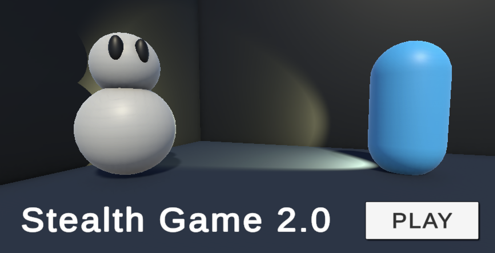
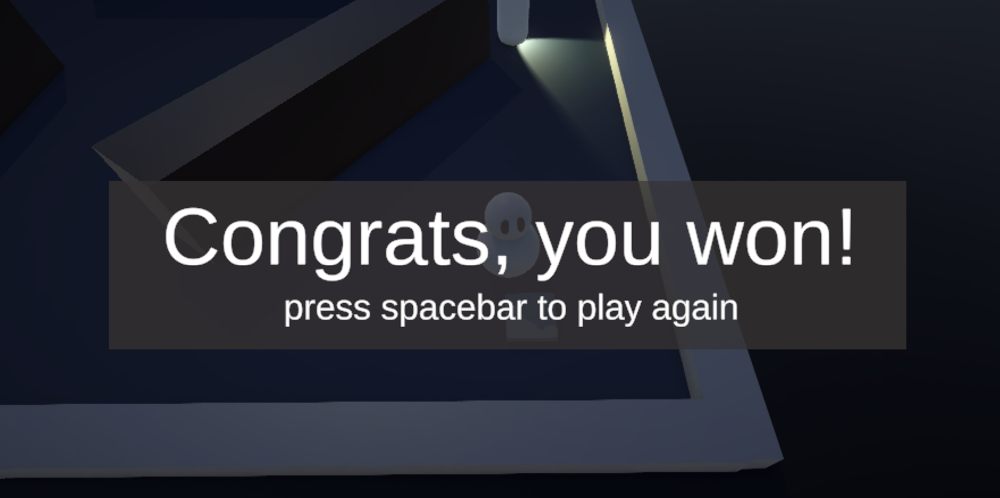
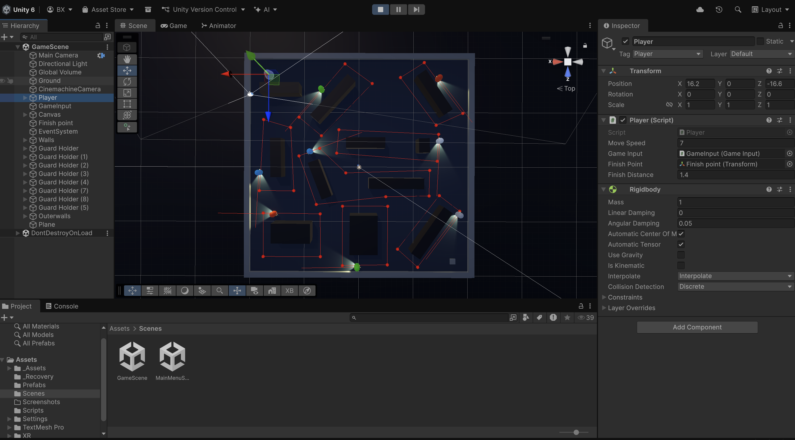
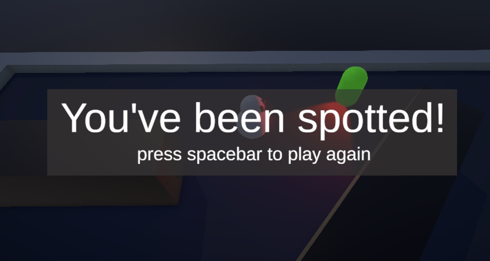

# Stealth Game 2.0

A 3D stealth game built with Unity, featuring guard patrols, basic player movement mechanics, and interactive environments.

## Table of Contents

- [Overview](#overview)
- [Installation](#installation)
- [Controls](#controls)
- [Project Structure](#project-structure)
- [Acknowledgements](#acknowledgements)
- [Additional Gameplay](#additional-gameplay)

## Overview

DEMO: https://github.com/bxiang17/Stealth-Game-2.0/blob/main/Assets/Screenshots/Video.mp4

This Unity project demonstrates:

- Third-person player movement
- Enemies with patrol routes and vision (flashlight) cones that change colour if caught
- Modular scene setup for quick prototyping
- GOAL: reach the finish point before being caught by the guards!

## Installation

1. Clone the repository:

```bash
git clone git@github.com:bxiang17/Stealth-Game-2.0.git
```
2. Open the project in Unity 2023+.
3. Allow Unity to re-import assets (Library folder is ignored in Git).

## Controls

| Action         | Key/Button        |
| -------------- | ----------------- |
| Move Player    | WASD / Arrow Keys |

## Project Structure

- **Assets/**          -> All game assets, scenes, scripts, and prefabs
- **Packages/**        -> Unity package manager dependencies
- **ProjectSettings/** -> Unity project configuration
- **.gitignore**       -> Excludes Library/, Temp/, Logs/, etc.

## Additional Gameplay

<p align="center">
  
  
</p>

<p align="center">
  
  
</p>

## Acknowledgements
This game was inspired from tutorials made by CodeMonkey and Sebastian Lague.

